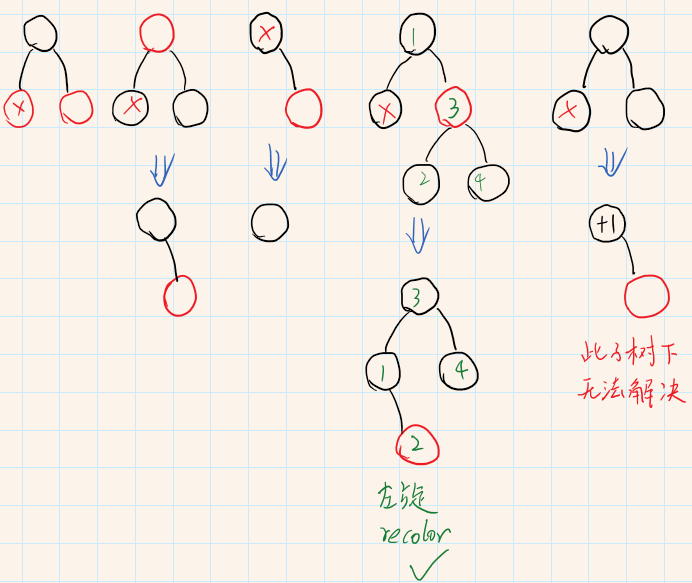
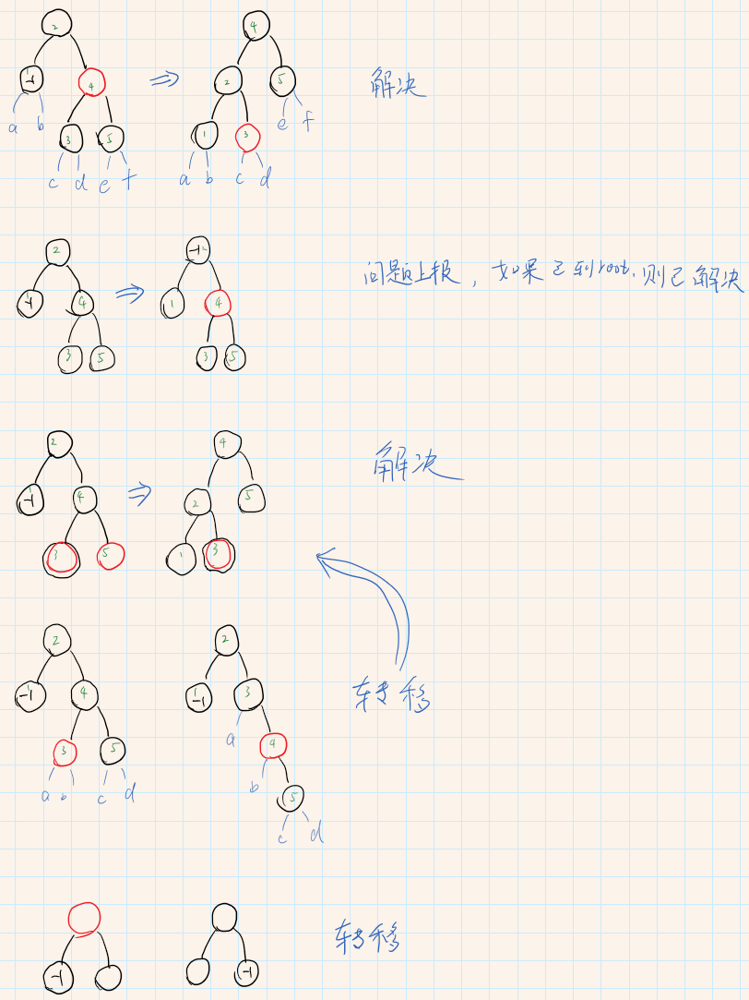

### 1. 数组

#### 1.1 稀疏数组（sparse array）

### 2. 队列

#### 2.1 环形队列

#### 2.2 单向链表队列

#### 2.3 双向链表队列

#### 2.4 数组队列

### 3. 堆栈

### 4. 哈希

### 5. 树

#### 5.1 平衡二叉树（AVL-Tree）

> 如果2号子树比1和3子树的高度都要大1。那么不管怎么左旋和右旋都不能使整棵树平衡。
> 平衡应该从下往上，只有，只能，平衡了子树，整棵树就平衡了。

#### 5.2 红黑树

特征

> 1. 根结点和叶子结点（null结点）是黑色的
>
> 2. 红色结点的子节点都是黑色的
>
> 3. 结点到它左右子树叶子的路径上，经过相同数量的黑色结点

插入

> 新插入的结点都是红色的，当新插入的结点导致两个红色结点为父子时，需要进行变色、旋转的调整：
>
> 1. uncle结点为红色：父结点和uncle结点变成黑色，祖父结点变成红色，指针到祖父结点，继续往上检查
> 2. uncle结点为黑色，且当前结点、父结点、祖父结点不在一条直线上：当前结点和父结点选择，旋转后就变成情况3了
> 3. uncle结点为黑色，且当前结点、父节点、祖父结点在一条直线上：父结点和祖父结点旋转，旋转后父结点变成黑色，原祖父结点变成红色

删除

> 1. 如果要删除的结点下面有两个子结点，可以用右子树的最小值顶替当前结点，转化成删除右子树最小值。
> 2. 最终会被删除的结点就是上面图5.2.1列举的情况（左右镜像对称的情况就只列出左边的情况了），除了最后一种情况，其他的都可以在其父结点下达成新的红黑树平衡
> 3.  删除最后一种情况的黑点后，该路径缺少一个黑色结点，且无法解决。我们将该结点的兄弟变成红色后，在父结点的两边平衡后，把缺少黑色结点的问题抛给父结点

> 3.1 如果兄弟结点时红色，可以通过旋转和recolor重新平衡
>
> 3.2 如果父结点是黑色，兄弟结点也是黑色，且兄弟结点的子结点都是黑色，可以将兄弟结点变成红色，使父节点下的左右子树黑点平衡，把路径上缺少一个黑色结点的问题抛给其父结点。
>
> 3.3 如果父结点是黑色，兄弟结点的右子结点是红色，则可以通过旋转和recolor重新平衡
>
> 3.4 如果父节点是黑色，兄弟结点的右子结点是黑色，但左子结点是红色，可以通过旋转将左子节点转到右边，然后就跟情况3.3一样了
>
> 3.5 如果父节点是红色，可以将其变成黑色，把路径上缺少黑结点的问题抛到兄弟结点上，然后就可以更具3.1-3.4来解决问题了
