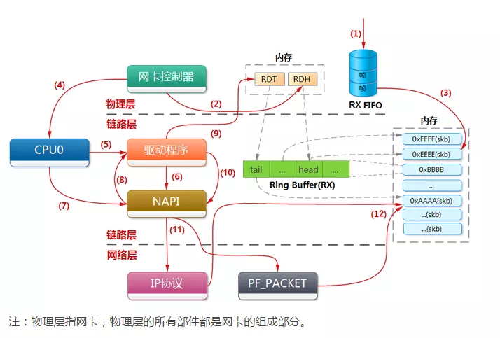
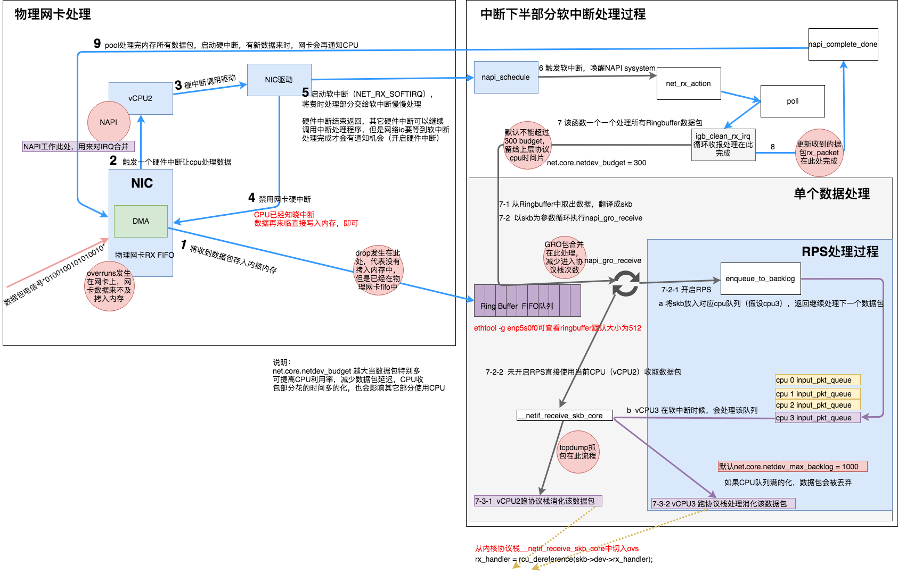

### 1. IO

```ruby
                   +-----+
                   |     |
                   |     |
+--------+    1    |     |    2 DMA     +--------+--------+--------+--------+
| Packet |-------->| NIC |------------->| Packet | Packet | Packet | ...... |
+--------+         |     |              +--------+--------+--------+--------+
                   |     |
                   |     |<------------------------+
                   +--+--+                         |
                      |                            |
                      |                          5 | Disable IRQ
                     3| Raise IRQ                  |
                      |                            |
                      v                            |
                   +--+--+                   +------------+
                   |     |  Run IRQ handler  |            |
                   | CPU |------------------>| NIC Driver |
                   |     |        4          |            |
                   +-----+                   +-----+------+
                                                   |
                                                 6 | Raise soft IRQ
                                                   |
```

> 1. 网卡接收到网络信号后，经过mac地址的检查和数据校验，将ip包保存到FIFO缓存中
> 
> 2. 通过中断通知DMA，DMA将FIFO中的数据保存到内存的ring buffer中（网卡中有ring buffer的地址）
> 
> 3. 网卡发出硬中断（IRQ）通知cpu处理
> 
> 4. cpu通过中断号找到网卡驱动，并执行
> 
> 5. 网卡驱动首先会禁用网卡向cpu发中断，有包来了先缓存到内存里
> 
> 6. 网卡驱动发出软中断（Soft IRQ）后退出驱动程序，剩下的交给软中断去处理

```ruby
                                                     +-----+
                                             17      |     |
                                        +----------->| NIC |
                                        |            |     |
                                        |Enable IRQ  +-----+
                                        |
                                        |
                                  +------------+                                      Memroy
                                  |            |        Read           +--------+--------+--------+--------+
                 +--------------->| NIC Driver |<--------------------- | Packet | Packet | Packet | ...... |
                 |                |            |          9            +--------+--------+--------+--------+
                 |                +------------+
                 |                      |    |        skb            
            Poll | 8      Raise softIRQ | 6  +-----------------+
                 |                      |             10       |
                 |                      ↓                      ↓         
         +---------------+  Call  +-----------+        +------------------+        +--------------------+  12  +---------------------+
         | net_rx_action |<-------| ksoftirqd |        | napi_gro_receive |------->| enqueue_to_backlog |----->| CPU input_pkt_queue |
         +---------------+   7    +-----------+        +------------------+   11   +--------------------+      +---------------------+
                                                               |                                                      | 13
                                                            14 |        + - - - - - - - - - - - - - - - - - - - - - - +
                                                               ↓        ↓                                                    
                                                    +--------------------------+    15      +------------------------+
                                                    | __netif_receive_skb_core |----------->| packet taps(AF_PACKET) |
                                                    +--------------------------+            +------------------------+
                                                               |
                                                               | 16
                                                               ↓                                                      
                                                      +-----------------+
                                                      | protocol layers |
                                                      +-----------------+
```

7. 内核程序ksoftirqd根据中断位，从驱动向量中拿到处理程序net_rx_action并执行（net/core/dev.c）

8. net_rx_action调用网卡驱动的poll方法（drivers/net/ethernet/intel/igb/igb_main.c  igb_poll）

9. 驱动读取ring buffer中的数据包，解析成linux的skb结构

10. skb作为参数执行napi_gro_receive方法，napi_gro_receive会将可以合并的数据包进行合并。

11. 如果开启了RPS，执行enqueue_to_backlog方法（net/core/dev.c）

12. 将skb放入cpu核心对应的队列input_pkt_queue中，如果队列满了，数据包将会被丢弃。队列的大小可以通过net.core.netdev_max_backlog来配置

13. 等对应cpu核心执行到软中断的时候就可以处理

14. 如果没有开启RPS，直接用当前cpu执行__netif_receive_skb_core方法（net/core/dev.c）

15. 看是不是有AF_PACKET类型的socket（也就是我们常说的原始套接字），如果有的话，拷贝一份数据给它。tcpdump抓包就是抓的这里的包。

16. 将数据包交给协议栈

17. 待内存中的所有数据包被处理完成后（即poll函数执行完成），启用网卡的硬中断，这样下次网卡再收到数据的时候就会通知CPU

ip协议栈：

```ruby
          |
          |
          ↓         promiscuous mode &&
      +--------+    PACKET_OTHERHOST (set by driver)   +-----------------+
      | ip_rcv |-------------------------------------->| drop this packet|
      +--------+                                       +-----------------+
          |
          |
          ↓
+---------------------+
| NF_INET_PRE_ROUTING |
+---------------------+
          |
          |
          ↓
      +---------+
      |         | enabled ip forword  +------------+        +----------------+
      | routing |-------------------->| ip_forward |------->| NF_INET_FORWARD|
      |         |                     +------------+        +----------------+
      +---------+                                                   |
          |                                                         |
          | destination IP is local                                 ↓
          ↓                                                 +---------------+
 +------------------+                                       | dst_output_sk |
 | ip_local_deliver |                                       +---------------+
 +------------------+
          |
          |
          ↓
 +------------------+
 | NF_INET_LOCAL_IN |
 +------------------+
          |
          |
          ↓
    +-----------+
    | UDP layer |
    +-----------+
```

协议栈udp层

```ruby
          |
          |
          ↓
      +---------+            +-----------------------+
      | udp_rcv |----------->| __udp4_lib_lookup_skb |
      +---------+            +-----------------------+
          |
          |
          ↓
 +--------------------+      +-----------+
 | sock_queue_rcv_skb |----->| sk_filter |
 +--------------------+      +-----------+
          |
          |
          ↓
 +------------------+
 | __skb_queue_tail |
 +------------------+
          |
          |
          ↓
  +---------------+
  | sk_data_ready |
  +---------------+
```



