### 0. 一些概念

#### 0.1 计算机中的时间

```markdown
2020: Still some improvements, prediction for 2025
-------------------------------------------------------------------------
             0.1 ns - NOP 
             0.3 ns - XOR, ADD, SUB
             0.5 ns - CPU L1 dCACHE reference           (1st introduced in late 80-ies )
             0.9 ns - JMP SHORT
             1   ns - speed-of-light (a photon) travel a 1 ft (30.5cm) distance -- will stay, throughout any foreseeable future :o)
?~~~~~~~~~~~ 1   ns - MUL ( i**2 = MUL i, i )~~~~~~~~~ doing this 1,000 x is 1 [us]; 1,000,000 x is 1 [ms]; 1,000,000,000 x is 1 [s] ~~~~~~~~~~~~~~~~~~~~~~~~~
           3~4   ns - CPU L2  CACHE reference           (2020/Q1)
             5   ns - CPU L1 iCACHE Branch mispredict
             7   ns - CPU L2  CACHE reference
            10   ns - DIV
            19   ns - CPU L3  CACHE reference           (2020/Q1 considered slow on 28c Skylake)
            71   ns - CPU cross-QPI/NUMA best  case on XEON E5-46*
           100   ns - MUTEX lock/unlock
           100   ns - own DDR MEMORY reference
           135   ns - CPU cross-QPI/NUMA best  case on XEON E7-*
           202   ns - CPU cross-QPI/NUMA worst case on XEON E7-*
           325   ns - CPU cross-QPI/NUMA worst case on XEON E5-46*
|Q>~~~~~ 5,000   ns - QPU on-chip QUBO ( quantum annealer minimiser 1 Qop )
        10,000   ns - Compress 1K bytes with a Zippy PROCESS
        20,000   ns - Send     2K bytes over 1 Gbps  NETWORK
       250,000   ns - Read   1 MB sequentially from  MEMORY
       500,000   ns - Round trip within a same DataCenter
?~~~ 2,500,000   ns - Read  10 MB sequentially from  MEMORY~~(about an empty python process to copy on spawn)~~~~ x ( 1 + nProcesses ) on spawned process instantiation(s), yet an empty python interpreter is indeed not a real-world, production-grade use-case, is it?
    10,000,000   ns - DISK seek
    10,000,000   ns - Read   1 MB sequentially from  NETWORK
?~~ 25,000,000   ns - Read 100 MB sequentially from  MEMORY~~(somewhat light python process to copy on spawn)~~~~ x ( 1 + nProcesses ) on spawned process instantiation(s)
    30,000,000   ns - Read 1 MB sequentially from a  DISK
?~~ 36,000,000   ns - Pickle.dump() SER a 10 MB object for IPC-transfer and remote DES in spawned process~~~~~~~~ x ( 2 ) for a single 10MB parameter-payload SER/DES + add an IPC-transport costs thereof or NETWORK-grade transport costs, if going into [distributed-computing] model Cluster ecosystem
   150,000,000   ns - Send a NETWORK packet CA -> Netherlands
  |   |   |   |
  |   |   | ns|
  |   | us|
  | ms|
```

#### 0.2 jmm

java memory model

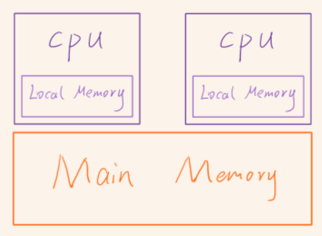

jmm在jvm中的实现

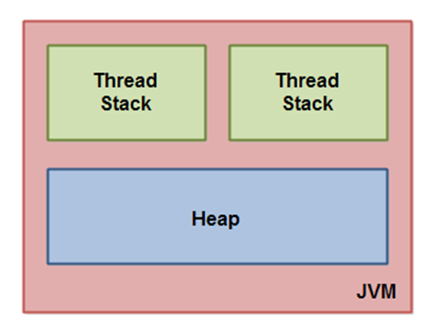

##### 0.2.1 指令重排序

out of order execution,可能由编译器，JVM或CPU进行指令重排

##### 0.2.2 变量的可见性

被线程load到local memory中的变量，在被修改后不会第一时间同步到main memory中。如果我们对变量添加volatile修饰符，那么jvm会帮助我们让其他线程第一时间知道该变量被修改了。

对于intel的芯片提供了一种缓存一致性协议，mesi（modify exclusive shared invalid），当一个核心读取lock变量时（volatile修饰的变量在编译成汇编语句之后，对该变量操作时，会加上lock前缀），会对其加上exclusive状态，并且一直嗅探总线，如果其他核心也要加载该变量，就将变量的状态改为shared，同时通过总线提醒另一个线程，这个变量已经被我加载了，大家都把状态改成shared。对shared变量进行修改前，要通知其他核心将变量改成invalid，然后自己改成modify，在修改完成后再将状态改成exclusive，并将结果写回主存。别的核心当读到invalid变量时，就得通过总线重新从主存读取。

### 1. 创建线程

创建线程归根到底只有一种方式，就是实现Runnable或其子类的run方法，但是形式可以有很多种。

#### 1.1 实现Runnable

实现Runnable，再交由Thread执行

#### 1.2 继承Thread

直接继承Thread，实现，运行一条龙

#### 1.3 实现Callable

实现Callable，再交给FutureTask，FutureTask是通过第一种方法实现的，在它的run方法中会调用Callable的call方法，并将结果、异常、状态存在变量中等待调取。

#### 1.4 线程池

通过线程池创建线程，将Runnable以任务的形式交给线程池执行。

> juc提供了两种线程池:
>
> ThreadPoolExecutor
>
> 完整的6个参数依次是：核心线程数，最大线程数，线程超时时间，线程超时单位，线程工厂，拒绝策略
>
> 

##### 1.4.1 ThreadPoolExecutor

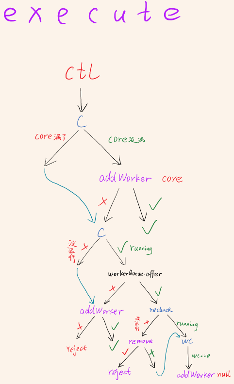

在core未满时，会新建worker，在核心worker满了之后会把任务放到queue里，如果queue里也满了就新建非核心worker，如果非核心worker也满了就reject该任务

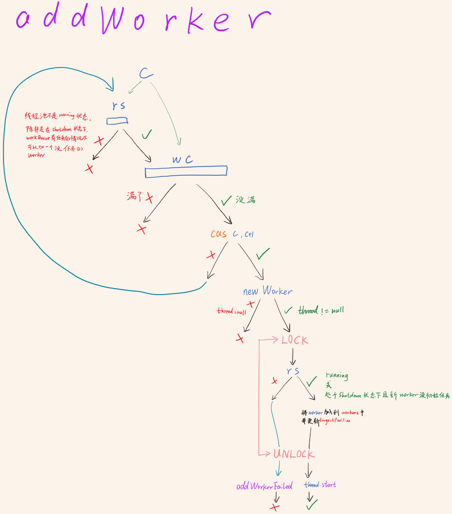

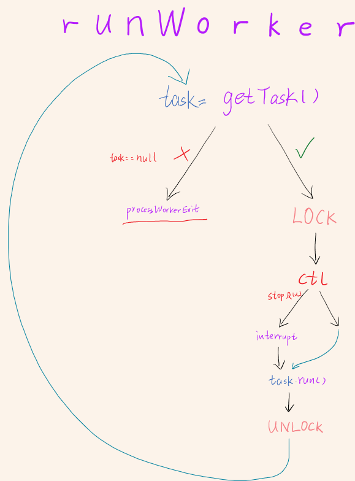

### 2.线程同步

#### 2.0 juc基础

##### 2.0.1 cas (compare and swap)

拿unsafe的compareAndSwapInt举例，它在unsafe.cpp中调用的是Atomic::cmpxchg

```cpp
1185  UNSAFE_ENTRY(jboolean, Unsafe_CompareAndSwapInt(JNIEnv *env, jobject unsafe, jobject obj, jlong offset, jint e, jint x))
1186    UnsafeWrapper("Unsafe_CompareAndSwapInt");
1187    oop p = JNIHandles::resolve(obj);
1188    jint* addr = (jint *) index_oop_from_field_offset_long(p, offset);
1189    return (jint)(Atomic::cmpxchg(x, addr, e)) == e;
1190  UNSAFE_END
```

而Atomic::cmpxchg在不同系统和cpu中调用不同的指令，我们拿linux x86来说,它的代码是这样的：

```cpp
93  inline jint     Atomic::cmpxchg    (jint     exchange_value, volatile jint*     dest, jint     compare_value) {
94    int mp = os::is_MP();
95    __asm__ volatile (LOCK_IF_MP(%4) "cmpxchgl %1,(%3)"
96                      : "=a" (exchange_value)
97                      : "r" (exchange_value), "a" (compare_value), "r" (dest), "r" (mp)
98                      : "cc", "memory");
99    return exchange_value;
100  }
```

我们可以看到它调用了一个cmpxchgl指令，与xchg不同，cmpxchg在多核cpu中是不原子的 。所以如果是mp（multiprocessor，多核cpu）我们需要在前面加上lock，使用缓存一致性协议来确保原子性。

```asciiarmor
             a=compare_value
                    │
                    ▼
            a=exchange_value?
            │              │
            │equal         │not equal
            ▼              ▼
[dest]=exchange_value   a=[dest]
            │              │
            ▼              ▼
      a=compare_value   a=[dest]
```

##### 2.0.2 AQS(AbstractQueuedSynchronizer)

> AQS加锁逻辑
>
> 1. 资格检验
>
>    1.1 state状态检验
>
>    1.2 锁线程拥有者检验
>
> 2. 资格检验通过后，cas/set
> 3. cas失败后进队列
> 4. 进入队列后继续尝试获取锁
> 5. 一般在两次尝试获取失败后将被park

###### 2.0.2.1 cas数据结构


###### 2.0.2.2 aquire逻辑(Exclusive)


###### 2.0.2.3 tryAcquire一般逻辑

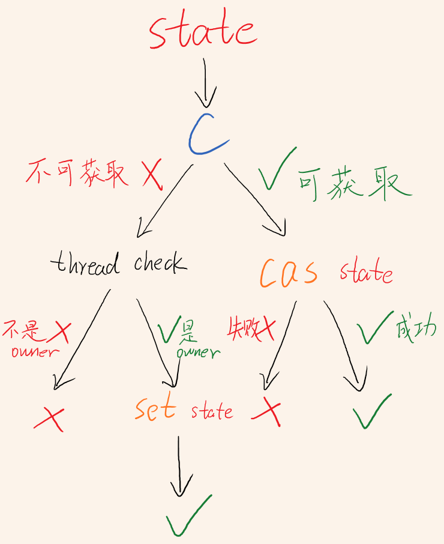

把state copy一份到线程本地变量c，对c和thread owner进行检查，看当前线程是否能修改或者尝试修改state。如果不能尝试或者尝试失败后return false，成功return true

###### 2.0.2.4 addWaiter数据结构


###### 2.0.2.5 addWaiter代码逻辑


把tail的引用copy到线程本地变量，先将node的prev连上它，在cas(tail, node)成功后再把tail.next连上node

###### 2.0.2.6 acquireQueued数据结构

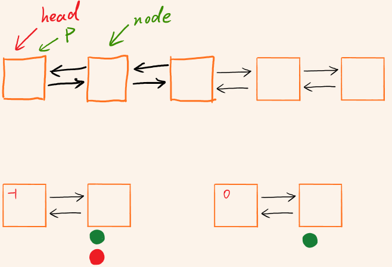

###### 2.0.2.7 accquireQueued代码逻辑

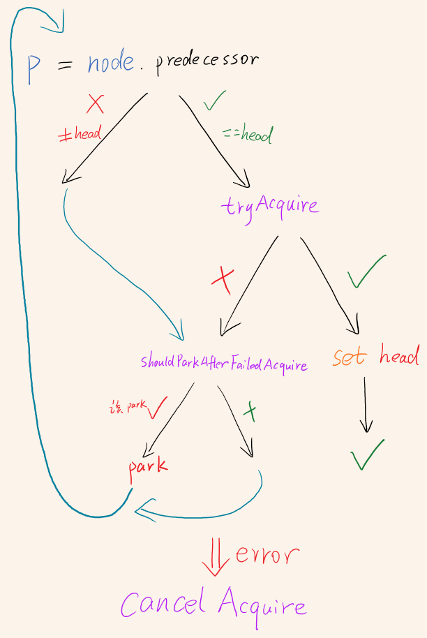

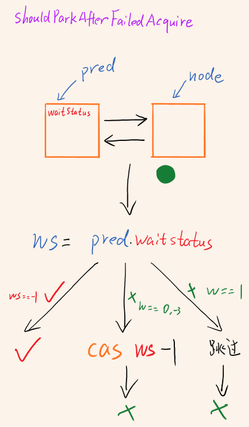

node在进入队列后会进行一次tryAcquire，失败后将前置结点的waitState改成-1，再次tryAcquire，失败后将直接park

#### 2.1 reentrantlock

##### 2.1.1 lock

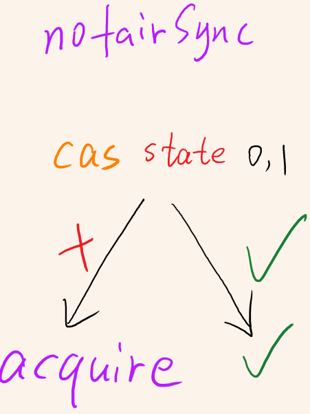

tryAcquire

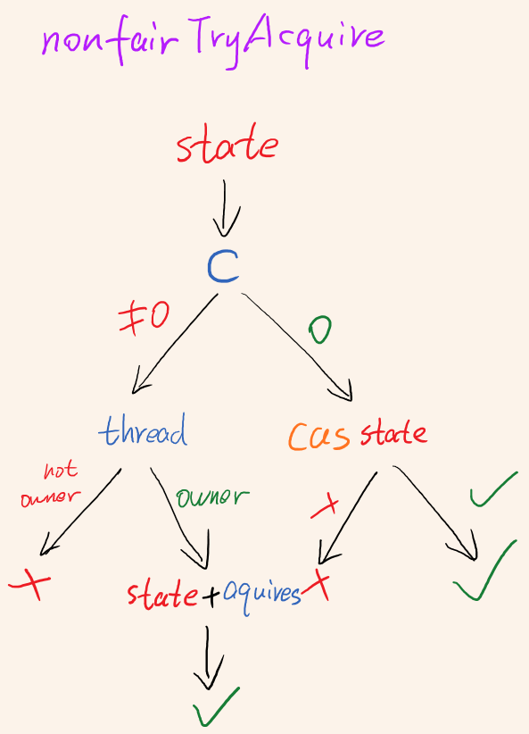

##### 2.1.2 unlock

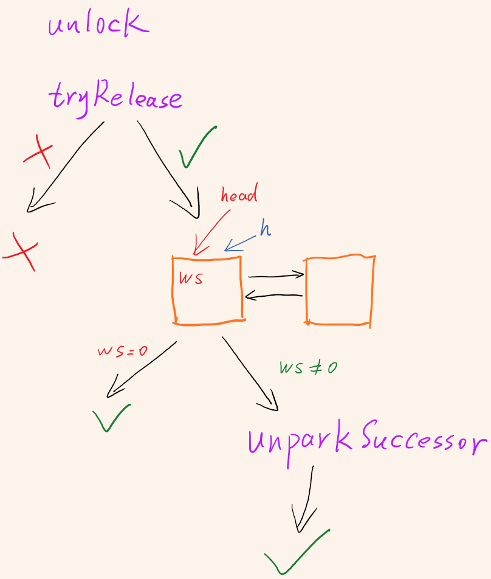

##### 2.1.3 tryRelease

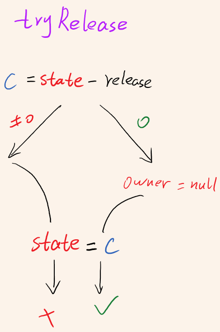