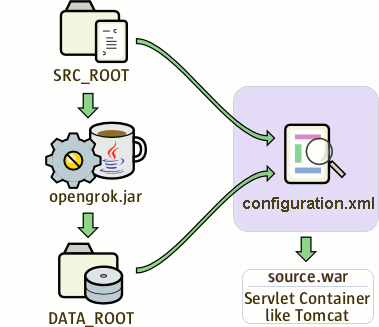

###  How to setup OpenGrok

#### 0. 前置条件

##### 0.1 java11

##### 0.2 opengrok软件

##### 0.3 [ctags](https://github.com/universal-ctags/ctags)

```bash
git clone https://github.com/universal-ctags/ctags.git
cd ctags
./autogen.sh
./configure --prefix=/where/you/want # defaults to /usr/local
make
make install # may require extra privileges depending on where to install
```

##### 0.4 tomcat10及以上

##### 0.5 git2.6及以上

##### 0.6 python3.6

#### 1. 设置文件结构

```bash
mkdir $OPENGROK_HOME/{src,data,dist,etc,log}
tar -C $OPENGROK_HOME/dist --strip-components=1 -xzf opengrok-X.Y.Z.tar.gz
```

##### 1.1 logging

```bash
cp $OPENGROK_HOME/dist/doc/logging.properties $OPENGROK_HOME/etc
```

日志配置

```properties
handlers= java.util.logging.FileHandler, java.util.logging.ConsoleHandler

java.util.logging.FileHandler.pattern = $OPENGROK_HOME/log/opengrok%g.%u.log
java.util.logging.FileHandler.append = false
java.util.logging.FileHandler.limit = 0
java.util.logging.FileHandler.count = 30
java.util.logging.FileHandler.level = ALL
java.util.logging.FileHandler.formatter = org.opengrok.indexer.logger.formatter.SimpleFileLogFormatter

java.util.logging.ConsoleHandler.level = WARNING
java.util.logging.ConsoleHandler.formatter = org.opengrok.indexer.logger.formatter.SimpleFileLogFormatter

org.opengrok.level = FINE
```

#### 2. 创建索引

索引的创建、目录和浏览：



SRC_ROOT：源码目录

DATA_ROOT：索引目录

opengrok.jar：为SRC_ROOT下的源码创建索引，放到DATA_ROOT下

source.war：通过configuration.xml配置的SRC_ROOT和DATA_ROOT，将它们在网页上显示出来

##### 2.0 设置源码

将源码copy到$OPENGROK_HOME/src文件夹下

##### 2.1 安装管理工具（可选，建议使用）

```bash
# This is assuming you have extracted the OpenGrok release tarball already and you are using bash:
cd tools
python3 -m venv env
. ./env/bin/activate
pip install opengrok-tools.tar.gz
```

##### 2.2 部署web app

把$OPENGROK_HOME/dist/lib/source.war copy到$CATALINA_BASE/webapps下启动tomcat让它解压source.war包。

```bash
opengrok-deploy -c $OPENGROK_HOME/etc/configuration.xml \
    $OPENGROK_HOME/dist/lib/source.war $CATALINA_BASE/webapps
```

##### 2.3 创建索引

```bash
java \
    -Djava.util.logging.config.file=$OPENGROK_HOME/etc/logging.properties \
    -jar $OPENGROK_HOME/dist/lib/opengrok.jar \
    -c /usr/local/bin/ctags \
    -s $OPENGROK_HOME/src \
    -d $OPENGROK_HOME/data -H -P -S -G \
    -W $OPENGROK_HOME/etc/configuration.xml \
    -U http://localhost:8080/source
```

or

```bash
opengrok-indexer \
    -J=-Djava.util.logging.config.file=$OPENGROK_HOME/etc/logging.properties \
    -a $OPENGROK_HOME/dist/lib/opengrok.jar -- \
    -c /usr/local/bin/ctags \
    -s $OPENGROK_HOME/src \
    -d $OPENGROK_HOME/data -H -P -S -G \
    -W $OPENGROK_HOME/etc/configuration.xml \
    -U http://localhost:8080/source
```


[opengrok github](https://github.com/oracle/opengrok)；[opengrok软件下载](https://github.com/oracle/opengrok/releases)；[搭建方式](https://github.com/oracle/opengrok/wiki/How-to-setup-OpenGrok)

